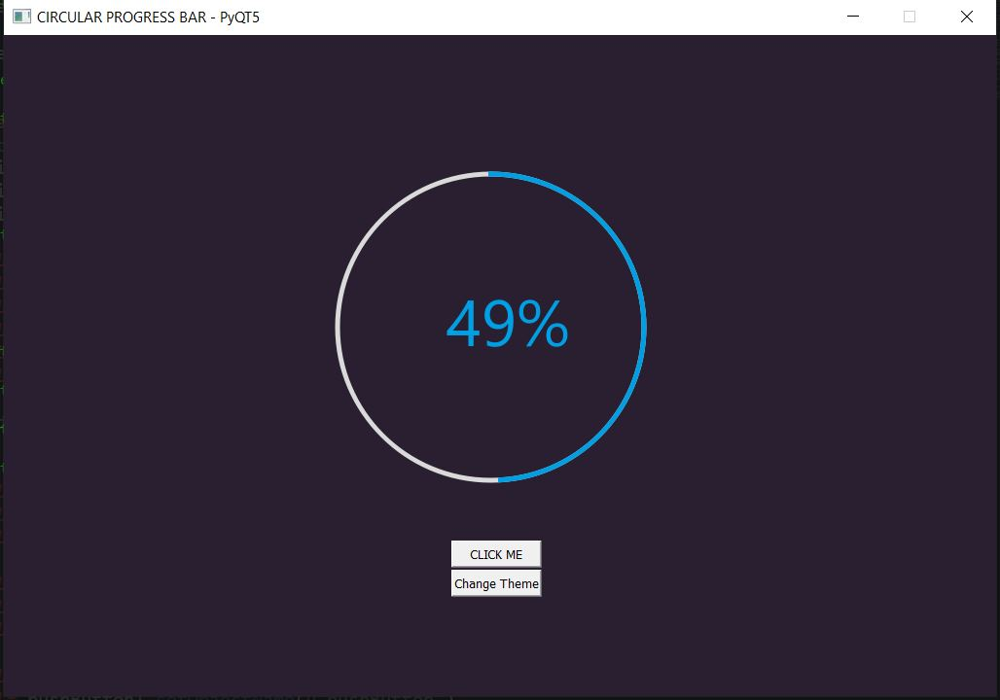

# PyQt5-Circular-Progressbar
A simple GUI to show how to implement a circular progressbar in PyQt5. 

Information:
------------
- Programming Language: Python
- Framework: PyQt5
- Library: PyQt5,PySide2extn

Information:
------------
- pip install pyqt5
- pip install PySide2extn

Screenshot
---------------

          
          
